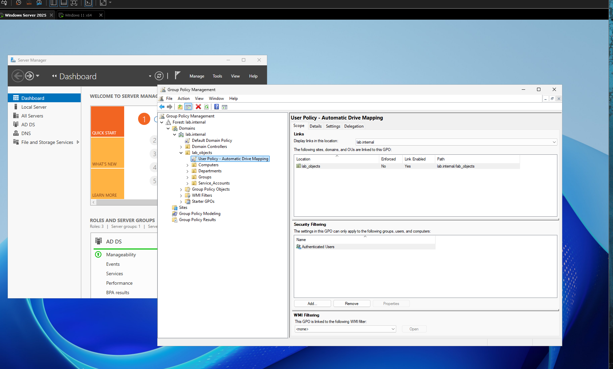
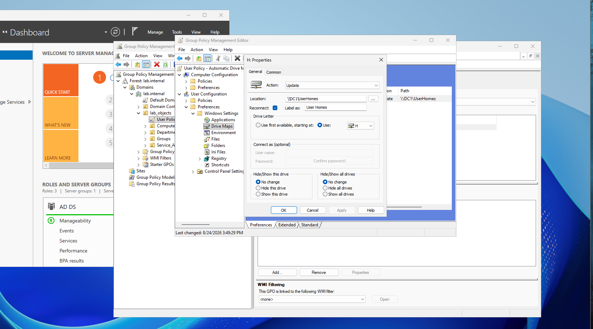
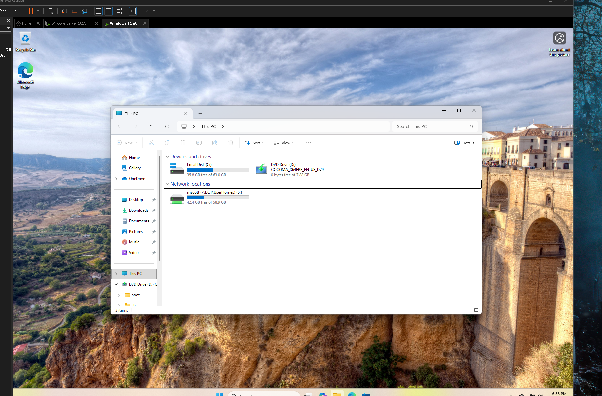
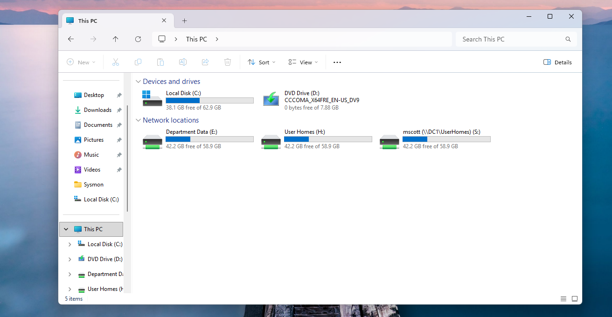

# aadds-drive-mapping
AD DS GPP lab demonstrating automated user network drive mapping and GPO client deployment on Windows 11.
# Active Directory Automated Drive Mapping Lab

This repository demonstrates the configuration and deployment of GPP for automatic network drive mapping in an AD DS environment.

---

## Configuration

### 1. Group Policy Link & Security Scope
The GPO **User Policy - Automatic Drive Mapping** is linked directly to the `lab_objects` Organizational Unit. Security Filtering applies to `Authenticated Users` across the domain hierarchy.

### 2. Group Policy Preferences (GPP) Drive Map Setup
Drive mappings are configured under **User Configuration > Preferences > Windows Settings > Drive Maps** using the **Update** action to ensure drive states are dynamically reconciled upon user logon.

* **Target Location:** `\\DC1\UserHomes`
* **Drive Letter:** `H:`
* **Label:** `User Homes`
* **Reconnect Status:** Enabled

---

## Client Validation & Results

### Initial Mapping Verification
Upon domain logon for user `mscott`, Active Directory automated share provisioning maps the user's home directory.

* **Share Path:** `\\DC1\UserHomes`
* **Drive Mapping:** `mscott (\\DC1\UserHomes) (S:)`

### Extended Multi-Drive Deployment
Following GPO background update (`gpupdate /force`) and user session refresh, additional department shares and preference mappings populate automatically under **Network locations** in File Explorer:

1. **Department Data (`E:`)** – Shared organizational volume for department-level data storage.
2. **User Homes (`H:`)** – Dedicated user personal network directory mapped via Group Policy Preferences.
3. **mscott (`S:`)** – Direct user home folder mapping.

---

## Implementation Summary

1. Provisioned network share paths on Domain Controller `DC1` with appropriate SMB Share and NTFS permissions.
2. Created and linked `User Policy - Automatic Drive Mapping` within Group Policy Management Console (`gpmc.msc`).
3. Defined Drive Map preferences targeting standard UNC paths (`\\DC1\UserHomes`) using static drive letter assignments (`H:`).
4. Verified successful policy propagation on domain-joined Windows 11 client endpoints.
